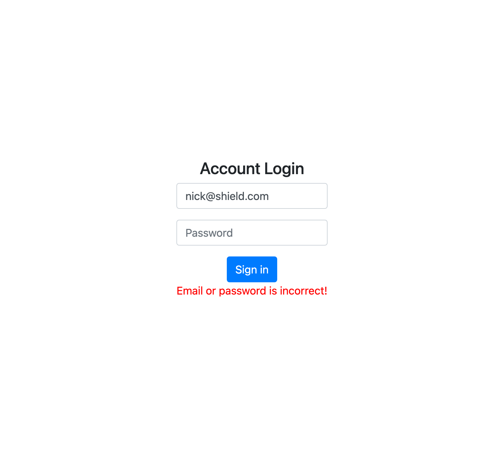

# Account Login

## Features

Use below data to test account login function.

```
const users = [
 {
   firstName: 'Tony',
   email: 'tony@stark.com',
   password: 'iamironman'
 },
 {
   firstName: 'Steve',
   email: 'captain@hotmail.com',
   password: 'icandothisallday'
 },
 {
   firstName: 'Peter',
   email: 'peter@parker.com',
   password: 'enajyram'
 },
 {
   firstName: 'Natasha',
   email: 'natasha@gamil.com',
   password: '*parol#@$!'
 },
 {
   firstName: 'Nick',
   email: 'nick@shield.com',
   password: 'password'
 }
]
```

## Preview



## Installing

1. 打開終端機 (Terminal) 輸入以下訊息，下載專案至本機

```
git clone https://github.com/ravenera0317/account-login
```

2. 進入專案目錄資料夾

```
cd account-login
```

3. 安裝 npm 套件

```
npm install
```

4. 啟動伺服器來執行專案

```
npm run dev
```

5. 出現以下訊息即可打開瀏覽器輸入 http://localhost:3000 開始使用

```
App is running on http://localhost:3000
```
