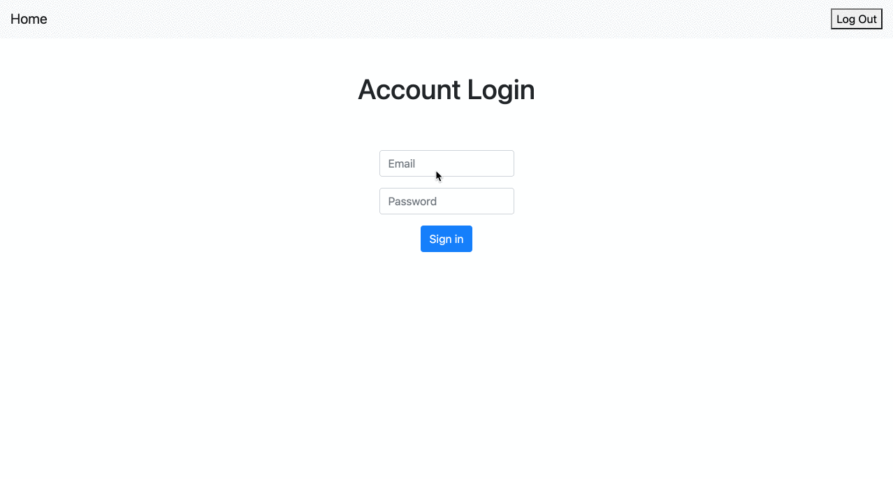

# Login Authenticator

透過 express-session 套件實作登入/登出功能

## Features

使用以下帳號密碼做測試：

```
email: 'tony@stark.com'
password: 'iamironman'

email: 'captain@hotmail.com'
password: 'icandothisallday'

email: 'peter@parker.com'
password: 'enajyram'

email: 'natasha@gamil.com'
password: '*parol#@$!'

email: 'nick@shield.com'
password: 'password'
```

## Preview



## Prerequisites

- Express v4.17.1
- Express-Handlebars v5.3.2
- Express-Session v1.17.2
- Mongoose v5.13.4

## Installing

1. 打開終端機 (Terminal) 輸入以下訊息，下載專案至本機

```
git clone https://github.com/ravenera0317/login-authenticator.git
```

2. 進入專案目錄資料夾

```
cd login-authenticator
```

3. 安裝 npm 套件

```
npm install
```

4. 下載種子資料

```
npm run seed
```

5. 啟動伺服器來執行專案

```
npm run dev
```

6. 出現以下訊息即可打開瀏覽器輸入 http://localhost:3000 開始使用

```
App is running on http://localhost:3000
```
